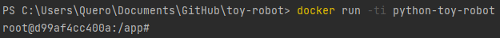
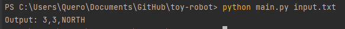

# TOY ROBOT


#### You can run via docker or terminal.
## RUN DOCKER:
Make sure docker is running.

## BUILD DOCKER IMAGE:
* You can change the base docker image used by changing the following lines on [Dockerfile](Dockerfile) to the version you want (FROM ubuntu:latest):
```
FROM python:3.8-slim-buster
```

To use with docker you must first build the docker image using the following command:
* You can replace the "python-toy-robot" with the image name you want

```
docker build --tag python-toy-robot . 
```

## RUN DOCKER IMAGE:
To run the docker image use the following command:
```
docker run -ti python-toy-robot
```
* The '-ti' parameter
  * '-t' Allocate a pseudo-TTY
  * '-i' Keep STDIN open even if not attached



## RUN SOLUTION (Docker or Terminal):
* If you use Docker, use ```python3``` (since python3 is already installed using the Dockerfile)
* If you use Terminal, follow instructions: "HOW TO SET UP PYTHON ON YOUR TERMINAL" below and continue here.


To run the solution pass an input file or type manually.
```
python3 main.py <input.txt>
```
[TLDR] You can use this file as example [input.txt](input.txt)
```
python3 main.py input.txt
```

 
## If you want to type manually:

```
python3 main.py
```

## MACROS / COMMANDS:
### PLACE
Will create a robot object and place on the board. Must be placed first.

```
PLACE <x>,<y>,<direction>
```
Usage:
```
PLACE 1,2,EAST
```

### MOVE
Will move 1 place forward where the robot is currently facing. Will not move if the robot will go out of bounds

Usage:
```
MOVE
```

### LEFT
Will rotate the robot 90 degrees to the LEFT direction without changing the position of the robot.

Usage:
```
LEFT
```

### RIGHT
Will rotate the robot 90 degrees to the RIGHT direction without changing the position of the robot.

Usage:
```
RIGHT
```

### REPORT
REPORT will announce the X,Y and F of the robot. 

Usage:
```
REPORT
```


## HOW TO RUN THE TESTS:
To run the pytest execute the following command.
```
pytest tests
```

## HOW TO EXIT
To exit docker type the following command.
```
exit
```


## =======================
## HOW TO SETUP PYTHON ON YOUR TERMINAL

### IF YOU DON'T HAVE PYTHON ON YOUR TERMINAL/PC
  * Install python using https://www.python.org/downloads/
  * Setup virtual environment: https://docs.python.org/3/library/venv.html
  * Make sure requirements.txt contains the following
#### [Requirements.txt](requirements.txt):
```
pytest>=3.0.7
```

  * How to install requirements:
```
pip install -r requirements.txt
```

### If you use Terminal, check which version your system supports using the command:
  * ```python --version``` or ```python3 --version```
  * Then modify the commands you will use accordingly.

### ========================================================

Author: [Christian Antony Quero](https://www.linkedin.com/in/christianquero/)